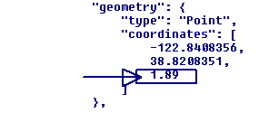
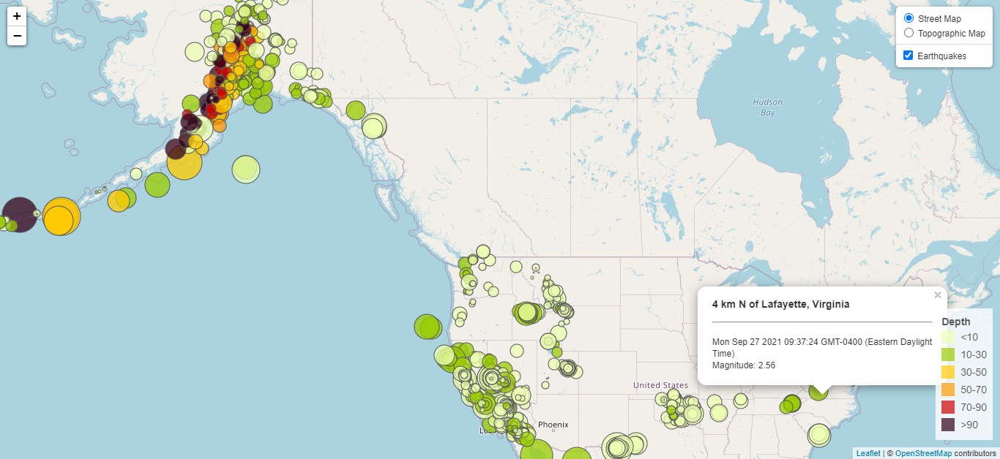
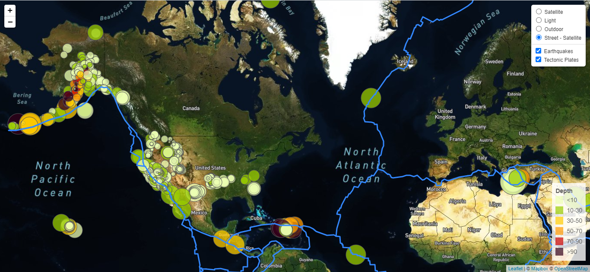

# leaflet-challenge

The USGS is responsible for providing scientific data about natural hazards, the health of our ecosystems and the environment; and the impacts of climate and land-use change. Their scientists develop new methods and tools to supply timely, relevant, and useful information about the Earth and its processes.

The purpose of this project  is to provide  a set of tools that will allow us to visualize USGS earthquake data. They collect a massive amount of data from all over the world each day.  USGS knows that having a set of tools to visualize their data will allow them to better educate the public and other government organizations (and hopefully secure more funding) on issues facing our planet.

### Basic Visualization (Level 1)

1. **Data Set and Import**

The USGS provides earthquake data in a number of different formats, updated every 5 minutes. From the [USGS GeoJSON Feed](http://earthquake.usgs.gov/earthquakes/feed/v1.0/geojson.php) page we retrieve a data set  "All Earthquakes from the Past 7 Days", a JSON representation of that data. 
The URL of this JSON was set to pull in the data for the basic visualization.

2. **Visualization**

The map was created using  <https://www.openstreetmap.org/> and Leaflet to plot all of the earthquakes from the data set based on their longitude and latitude.
In the basic visualizations two tile sets were used, street tiles and topo tiles (for topographic).

*Markers*

Data markers were created using Leaflet. Each marker reflects the magnitude of the earthquake by its size and depth of the earthquake by color. Earthquakes with higher magnitudes  appear larger and earthquakes with greater depth appear darker in color. 
Information about depth for each earthquake is stored as a third coordinate in json file.

    

*Popups*

Popup for each marker provide additional information about the earthquake when the marker is clicked:

- location description
- date 
- magnitude    

*Legend*

The depth of the earthquakes is showcased using a legend found at the bottom right corner of the map. The markers with darker color represent greater depth of the earthquakes.

The map below is showcasing  the final visualization for the earthquakes data set.

### Additional Data and Visualization (Level 2)

The second data set about tectonic plates was used to illustrate the relationship between tectonic plates and seismic activity. The data about plates were visualized  alongside the original set of data. Data on tectonic plates  were found at <https://github.com/fraxen/tectonicplates>.

The map sets for this part of visualizations were changed to MapBox <https://www.mapbox.com/maps/> to demonstrate  possible resources to showcase data through maps.  In this case different styles were used to create maps,  which can be found at <https://docs.mapbox.com/api/maps/styles/>. An example of API with public token is provided here:

The final visualization of these two data sets (earthquakes data and tectonic plates data) along with  different tiles is showen below.

